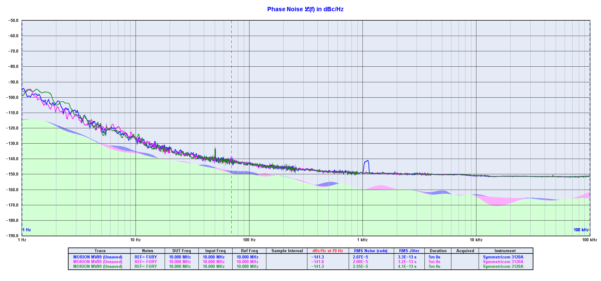

# Pruebas de ruido para el MORION MV89

Se ha probado el rendimiento del Morion MV89 en la placa que diseñó Alejandro para comprobar que se comporta mejor que el Fury a la hora de hacer medidas de estabilidad (usarlo como referencia).

## Pruebas

Primero se ha comprobado el modo *freerunning* del Jackson Labs Fury y del Morion MV89 para comprobar con los datos que obtuvo Anders Wallin ([ref][1]) con dicho oscilador comparado con un H-Maser.

La configuración de la prueba es la siguiente:

- Fury conectado a la entrada de referencia (usando 10MHz seno) sin antena para GPS.
- Morion MV89 conectado a la entrada de input (usando 10MHz seno)
- Microsemi 3120A para medir
- Cables RG-400 SMA-SMA y conectores SMA-BNC

He repetido la prueba tres veces y he obtenido los datos de la gráfica **morion_fr.png**:

En la primera medición se observa algo de ruido en torno a 1kHz. En ninguna de las otras repeticiones se observa así que descarto esta medición por causa de ruido externo. Se ha guardado los resultados del segundo intento por tener un RMS jitter más bajo.

En la página 12 de la presentación de [Anders Wallin](ref) tenemos el mismo experimento pero usando como referencia un H-Maser. En la parte de baja frecuencia el ruido del Fury es mayor por lo que limita la gráfica del Morion al haberlo usado como referencia.  En la parte de alta frecuencia ambos osciladores (Morion y Fury) tienen un perfil muy similar. 

## Referencias

[ref]: http://www.ohwr.org/attachments/4271/4_WR-workshop_2016_wallin.pdf