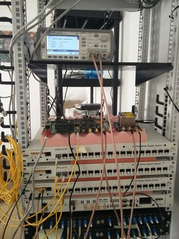

# Descripción de los ficheros de esta carpeta

Medidas en crudo tomadas con el Counter Keysight 53230A para los experimentos
del artículo de SKA.

## Configuración base

Para realizar estos experimentos se ha utilizado el siguiente material:

- 2 WRS con la versión 5.0 de firmware y 3.4 de hardware.
  - WRS GM: 378
  - WRS L2: 377
- 1 WR-ZEN sin caja (tal y como se ve en la foto). **Recordar que hay que programar el binario con el PPS fixed manualmente antes de hacer pruebas con la tarjeta.**
  - Número de serie: S1_012
  - Versión Hardware V2.0
  - Versión de software *v1.2-6-g46a4f7a-dirty*
  - Versión de gateware *2.0.5* (versión con el pps corregido de Rafa)
  - Gateware ID: gw_id 0x755e42fd
- 1 OCXO Morion MV89 como referencia del GM. El oscilador está montado en una placa que saca un PPS coherente a los 10MHz para usarlos como entrada del módulo GM.
- Cables buenos RG400 de 2m para hacer las medidas.
- Fibras de 5 m.
- SFPs usuales:
  - AXGE-1254-0531
  - AXGE-3454-0531

**Nota**: El binario no está calibrado. Con respecto a la calibración de la *release* (206628, 220234) se observa un desfase de ~2,260 ns. Se están utilizando los siguientes valores para corregirlo: 204368 y 222494. **Hay que escribirlos a mano después de arrancar.**

## Índice

- *prueba1_a.csv:* Primera medición de la prueba 1. Tomada el 20-02-17.
- *prueba2_a.csv*: Primera medición de la prueba 2. Tomada el 20-02-17.
- *prueba2_b.csv*: Segunda medición de la prueba 2. Tomada el 20-02-17.
- *prueba2_c.csv:* Tercera medición de la prueba2. Tomada el 21-02-17.

## Descripción de las pruebas

### Prueba 1

Comprobar el rendimiento del binario con el arreglo del PPS. Para esta prueba se ha conectado directamente la ZEN al WRS GM y se han comparado los PPS.

Se han repetido las medidas 3 veces.

### Prueba 2

Se ha medido TINT entre el WRS GM y la ZEN.

Se han repetido las medidas 3 veces.

### Prueba 3

Se ha medido TINT entre el WRS GM y el WRS L2.

Se han repetido las medidas 3 veces.

